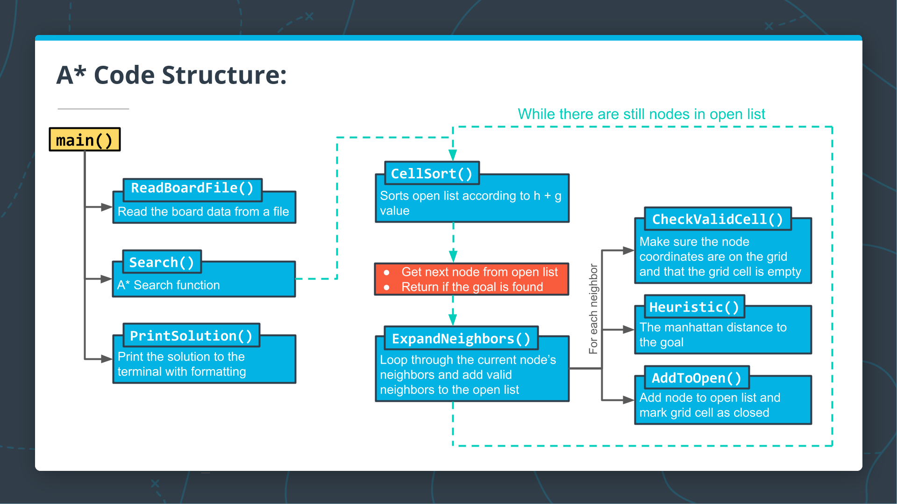

# nano-degree-first-mini--project

This is a starter repo for the CppND-First-Simi-Project.

## Dependencies for Running Locally
* cmake >= 3.7
  * All OSes: [click here for installation instructions](https://cmake.org/install/)
* make >= 4.1 (Linux, Mac), 3.81 (Windows)
  * Linux: make is installed by default on most Linux distros
  * Mac: [install Xcode command line tools to get make](https://developer.apple.com/xcode/features/)
  * Windows: [Click here for installation instructions](http://gnuwin32.sourceforge.net/packages/make.htm)
* gcc/g++ >= 5.4
  * Linux: gcc / g++ is installed by default on most Linux distros
  * Mac: same deal as make - [install Xcode command line tools](https://developer.apple.com/xcode/features/)
  * Windows: recommend using [MinGW](http://www.mingw.org/)

## Basic Build Instructions

1. Clone this repo
2. Make a build directory in the top level directory: `mkdir build && cd build`
3. Compile: `cmake .. && make`
4. Run it: `./CreatedMap`.

## Summary and A* Pseudocode

This algorithm described by Sebastian is very similar to other search algorithms you may have seen before, such as breadth-first search, except for the additional step of computing a heuristic and using that heuristic (in addition to the cost) to find the next node.

The following is psuedocode for the algorithm described in the video above. Although the pseudocode shows the complete algorithm in a single function, we will split parts of the algorithm into separate functions in this lesson so you can implement them step-by-step in a sequence of exercises:

```
Search( grid, initial_point, goal_point ) :

1. Initialize an empty list of open nodes.

2. Initialize a starting node with the following:

* x and y values given by initial_point.
* g = 0, where g is the cost for each move.
* h given by the heuristic function (a function of the current coordinates and the goal).

3. Add the new node to the list of open nodes.

4. while the list of open nodes is nonempty:

  1- Sort the open list by f-value
  2- Pop the optimal cell (called the current cell).
  3- Mark the cell's coordinates in the grid as part of the path.
  4- if the current cell is the goal cell:

    return the grid.

  5- else, expand the search to the current node's neighbors. This includes the following steps:

  * Check each neighbor cell in the grid to ensure that the cell is empty: it hasn't been closed and is not an obstacle.
  * If the cell is empty, compute the cost (g value) and the heuristic, and add to the list of open nodes.
  * Mark the cell as closed.

5. If you exit the while loop because the list of open nodes is empty, you have run out of new nodes to explore and haven't found a path.
```

Summary
The A* algorithm finds a path from the start node to the end node by checking for open neighbors of the current node, computing a heuristic for each of the neighbors, and adding those neighbors to the list of open nodes to explore next. The next node to explore is the one with the lowest total cost + heuristic (g + h). This process is repeated until the end is found, as long as there are still open nodes to explore.

## Code structures

The code for the A* search algorithm has been broken down into the following functions:
```
CellSort() - sorts the open list according to the sum of h + g
ExpandNeighbors() - loops through the current node's neighbors and calls appropriate functions to add neighbors to the open list
CheckValidCell() - ensures that the potential neighbor coordinates are on the grid and that the cell is open
Heuristic() - computes the distance to the goal
AddToOpen() - adds the node to the open list and marks the grid cell as closed
```

